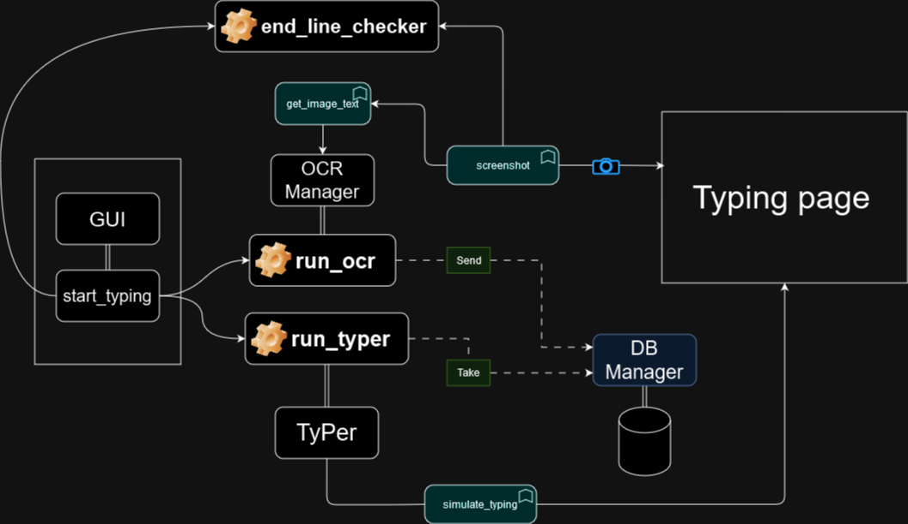

# QuickType-Bot

## Project Screenshot



## Demo Video

Click on the image below to view the demo video:

[](images/typyng_test.mp4 "Demo Video")

# To install poetry follow the instructions here
```bash
https://python-poetry.org/docs/#installing-with-pipx
```

# To install dependencies
```bash
poetry install
```

# To run the bot
```bash
poetry run dev
```

## To add a new dependency
```bash
poetry add <package-name>
```

## To add a new dev dependency
```bash
poetry add -D <package-name>
```

## To add new commands, edit the pyproject.toml file
```bash
[tool.poetry.scripts] # find this section
dev = "quicktype.main:dev" # add a new line here, where dev is the name of the command and quicktype.main:dev is the path to the function
```
